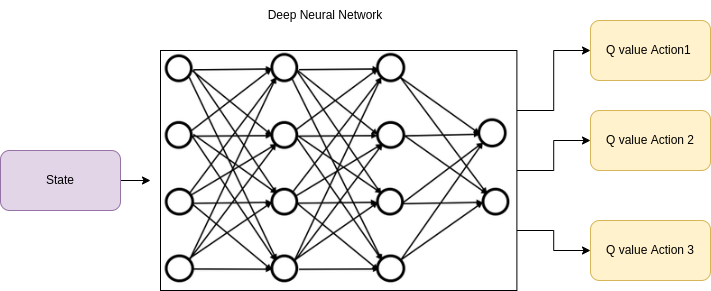
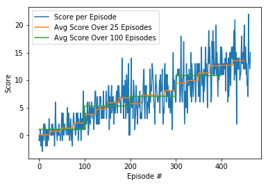
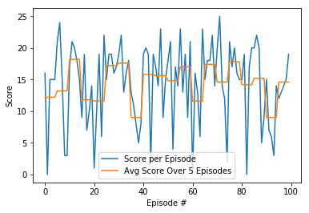

# Project 1: Navigation

# Goal
Agent must collect as many yellow bananas as possible while avoiding blue bananas. In order to solve the enviornment, an average score of 13 over 100 episodes must be achieved by the agent.

# Enviornment
State space: 37 dimensions which has the agent's velocity, along with ray-based perception of objects around agent's forward direction. Action space: Four discrete actions are available as followings:

0 - move forward.
1 - move backward.
2 - turn left.
3 - turn right.
The task is defined as an episodic task.

## Description of the implementation

### Algorithms
In order to solve this challenge, I have used below mentioned deep reinforcement learning algorithms:

* [Deep Q-Network](https://storage.googleapis.com/deepmind-media/dqn/DQNNaturePaper.pdf)

##### Deep Q-Network
In a enviornment where state space is infinite or very large, creating and updating Q-table will not be efficient. This is where Deep Q Learning comes to rescue. In DQN, the Q values are estimated using a NN. See the image below for reference.
<add image>

At each time step, a tuple of state, action, reward, and new state (S, A, R, S_new) is recieved. This tuple is called an experience. Each of these experiences is sequentially ordered. An NN feeds a small sample of data from the replay buffer in order to break this coorelation. To determine the best action, the biggest Q-value from the output vector is used. In the start, agent does not perform well, but that is OK. As the training progresses, agent learns more and more.

There are two processes that are happening in this algorithm:

1. We sample the environment where we perform actions and store the observed experiences tuples in a replay memory.
2. Select the small batch of tuple random and learn from it using a gradient descent update step.

The network description itself along with the agent details, interpretation of obtained results and possible future work ideas are described in sections ahead.
  

## Q Network

The trained network has a layout of two Fully Connected layers of 64 nodes each followed by another Fully Connected layer of 4 nodes, equal to the number of actions since it is the output layer.

Q-network architecture:

-Input layer FC1: 37 nodes in, 64 nodes out
-Hidden layer FC2: 64 nodes in, 64 nodes out
-Hidden layer FC3: 64 nodes in, 64 nodes out
-Output layer: 64 nodes in, 4 out — action size

## Agent

The Agent interacts with and learns from the environment.

It is given an initial state and decides which action is the best, then it observes which state derives from taking that action and gets the respective reward which is added to the score for that episode. Epsilon is updated each episode based on the hyperparameters.

These steps are repeated until the episode has finished. 

If the agent scores an average over 100 episodes equal or greater to the score goal it saves the network weights in a file called `checkpoint.pth`.

### Agent Behaviours

`act(self, state, eps=0.)`

The local Q Network is changed to evaluation mode based on the current state an action is choosen based the current policy using a epsilon greedy aproach.

`step(self, state, action, reward, next_state, done)`

It performs a step, potentially a learning step. An experience is saved into the Replay Memory and if enough steps have passed (based on a hyperparameter) the agent replays a random experience from memory and learns from it.

`learn(self, experiences, gamma)`

Changes local network to train mode and updates value parameters using a given batch of experience tuples (replay memory) and a discount factor.

It calculates the predicted maximum Q values for each next state using the target network and then uses these calculated values to find the value for each current state. 

Then the expected Q values for each state are also retrieved using the local network and the loss between the Q values of the local and the target is calculated (using the mean squared error).

This loss is then used for the backpropagation step along with the optimizer. 

Finally the network is updated using a soft update.

`soft_update(self, local_model, target_model, tau)`

Updates both the local and the target networks weights depending on the value of the hyperparameter tau.

### Implementation Details

- Replay Memory 

The replay buffer contains a collection of past experience tuples (state,action,reward,next state,done).

The act of sampling a small batch of tuples from the replay buffer in order to learn is known as experience replay.

In addition to breaking harmful correlations, experience replay allows us to learn more from individual tuples multiple times, recall rare occurrences, and in general make better use of our experience.

- Target Network

In Q-Learning, we update a guess with a guess, and this can potentially lead to harmful correlations.

To avoid this, we can update the weights in the network by predicting the values of the next states using a target network (different from the local network) and then calculating the loss using the mean squared average between these values and the values the local network expects. 

This loss is then used for the backpropagation step.

The target network is similar to the local network with the only difference being that the target network updates itself in a more slow and stable way than the local network (how slow/stable is controlled by tau's value).

This is done with the intent of the target being as stable as possible and to avoid problems derived from trying to chase a moving target.

- Optimizer

Adam Optimizer is used for the backpropagation step and gradient descent, this is one of the most used optimizers since it generates good results almost always.

### Hyperparameters
There were many hyperparameters involved in the experiment. The value of each of them is given below:

-BUFFER_SIZE = int(1e5) # replay buffer size
-BATCH_SIZE = 64 # mini batch size
-GAMMA = 0.99 # discount factor
-TAU = 1e-3 # for soft update of target parameters
-LR = 5e-4 # learning rate
-UPDATE_EVERY = 4 # how often to update the network
-Epsilon start = 1.0
-Epsilon start = 0.01
-Epsilon decay = 0.995
-Activation = relu (on first and second layer)

### Training 

If the model is training and achieves its objective of having a average score of 13 on 100 episodes its weights will be saved to a file `checkpoint.pth` which then can be used to test the network and see it perform in test mode.

Note that the environment is considered solved 100 episodes before reaching the average score of 13 over 100 episodes.

In this case, the Agent solved the environment after **~360 episodes**.

### Testing

Below is an example of the model performing after being trained on around 1000 episodes and its attained score over 100 episodes.

Similarly, the scores over episodes are ranging  from a maximum of 25 to a minimum of 3, with an average of 18 points.

## Conclusion
An average score of 13 was achieved in 364 episodes of the environment. There are certainly improvements that could be made from here. The following ideas can help improve results.

## Ideas for Future Work

### Q Network

- Number of Layer and Nodes Variations

One can experiment with different number of layers/nodes in each layer to create either a more powerful or a lighter and simpler network. Having a more powerful network (more layers and nodes) will require more training time, and the opposite will be true for a lighter network.

- Input Pixels

As an alternative to in-game data, the network could be modified to take as an input environment pixels (which might need preprocessing like grayscale, etc.) instead of in-game data.

Other algorithms proposed to enhance the performance of the Deep Q-Network are:  
   * [Noisy DQN](https://arxiv.org/abs/1706.10295)  
   * [Distributional DQN](https://arxiv.org/abs/1707.06887)
  
## References
* [Deep Q learning](https://www.geeksforgeeks.org/deep-q-learning/)
