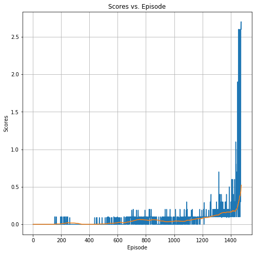

[//]: # (Image References)

[image1]: https://user-images.githubusercontent.com/10624937/42135623-e770e354-7d12-11e8-998d-29fc74429ca2.gif "Trained Agent"

# Project 3: Collaboration and Competition

### Introduction

For this project, you will work with the [Tennis](https://github.com/Unity-Technologies/ml-agents/blob/master/docs/Learning-Environment-Examples.md#tennis) environment.

![Trained Agent][image1]

In this environment, two agents control rackets to bounce a ball over a net. If an agent hits the ball over the net, it receives a reward of +0.1.  If an agent lets a ball hit the ground or hits the ball out of bounds, it receives a reward of -0.01.  Thus, the goal of each agent is to keep the ball in play.

The observation space consists of 8 variables corresponding to the position and velocity of the ball and racket. Each agent receives its own, local observation.  Two continuous actions are available, corresponding to movement toward (or away from) the net, and jumping. 

The task is episodic, and in order to solve the environment, your agents must get an average score of +0.5 (over 100 consecutive episodes, after taking the maximum over both agents). Specifically,

- After each episode, we add up the rewards that each agent received (without discounting), to get a score for each agent. This yields 2 (potentially different) scores. We then take the maximum of these 2 scores.
- This yields a single **score** for each episode.

The environment is considered solved, when the average (over 100 episodes) of those **scores** is at least +0.5.

## Getting Started
### Included in this repository

* The code used to create and train the Agent
  * Tennis.ipynb
  * ddpg.py
  * maddpg.py
  * model.py
  * ounoise.py
  * replay_buffer.py
  
* The trained model
  * checkpoint_actor_0.pth
  * checkpoint_actor_1.pth
  * checkpoint_critic_0.pth
  * checkpoint_critic_1.pth
  
* A file describing all the packages required to set up the environment
  * python folder
  
* An explanation of the learning algorithm and the step-by-step process is included in the Report.md file.The report also offers suggestions for improving the results
  
  * README.md File`


### Getting Started

* Follow the instructions in this link in order to install the Unity ML-Agents Tennis Environment required to run this project:
https://github.com/udacity/deep-reinforcement-learning/tree/master/p3_collab-compet#getting-started

* TO Install necessary packages.<br/>
  Execute this command in order to install the software specified in `requirements.txt`<br/>
  ```pip -q install ./python```<br/>
  This command is executed at the beginning of the Jupyter notebook [Tennis.ipynb](Tennis.ipynb).

  Alternately you can even install 
  ```
  pip install -r /Project3_Collaboration_and_Competition/python/requirements.txt
  ```
   
### Instructions

Follow the instructions in `Tennis.ipynb` to get started with training your own agent!  

## Results

The average rewards along with the traning process show as following:



Detailed results are found in [**Report.md**](Report.md).

## Acknowledgement
Code was adapted from Udacity Reinforcement Learning Nano-Degree's DDPG lesson and modified for this project. 

