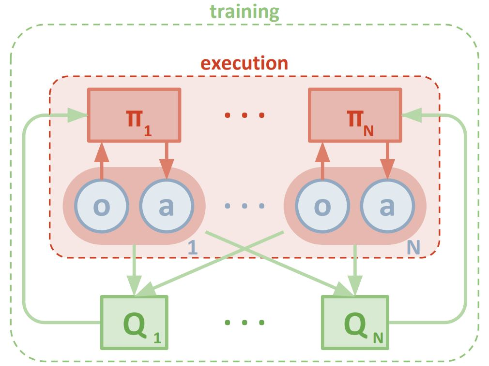

[//]: # (Image References)

[image1]: img/maddpg.jpeg "Multi-agent decentralized actor, centralized critic"
[image2]: img/training.png "training result"
[image3]: img/testing.png "testing result"

# Project Report: Multi Agent Actor-critic Collaboration and Competition

### Algorithm 
Following the Multi-Agent Actor Critic approach presented [here](https://proceedings.neurips.cc/paper/2017/file/68a9750337a418a86fe06c1991a1d64c-Paper.pdf), each racket is represented by an individual actor network. While each actor only samples from own experiences, the central critic samples from the shared experiences of both agents.



The actor and critic networks consist of a fully-connected hidden layer followed by a batch normilization and two fully-connected hidden layers with relu activation: 

The Project goes beyond DQN. Because it includes new Deep RL techniques:

The DDPG Agent uses 2 deep neural networks to represent complex continuous states. 1 neural network for the actor and 1 neural network for the critic.

The neural network for the actor has:
- A linear fully-connected layer of dimensions state_size=`state_size` and fc1_units=128;
- The ReLu function;
- Batch normalization;
- A linear fully-connected layer of dimensions fc1_units=128 and fc2_units=128;
- The ReLu function;
- A linear fully-connected layer of dimensions fc2_units=128 and action_size=`action_size`;
- The tanh function.

The neural network for the critic has:
- A linear fully-connected layer of dimensions state_size=`state_size` and fcs1_units=128;
- The ReLu function;
- Batch normalization;
- A linear fully-connected layer of dimensions fcs1_units=128 + `action_size` and fc2_units=128;
- The ReLu function;
- A linear fully-connected layer of dimensions fc2_units=128 and output_size=1;

### metaparameters

| Parameter | Value |Description|
| ------------- | ------------- |------------- |
| BUFFER_SIZE  | int(1e5)  | replay buffer size|
| BATCH_SIZE  | 128  |minibatch size|
| GAMMA  | 0.99   |discount factor|
| TAU  | 1e-3  | for soft update of target parameters|
| LR_ACTOR  | 2e-4  |learning rate of the actor|
| LR_CRITIC  | 2e-4  | learning rate of the critic|
| WEIGHT_DECAY  | 0  |L2 weight decay|

### plot of Rewards 
The agents solved the environment in  **1475** episodes by collective average reward of 0.50 over last 100 episodes with  target limit of training  set to 50k episodes.
```
Episode 100	Average Score: 0.0000
Episode 200	Average Score: 0.0070
Episode 300	Average Score: 0.0158
Episode 400	Average Score: 0.0000
Episode 500	Average Score: 0.0054
Episode 600	Average Score: 0.0222
Episode 700	Average Score: 0.0412
Episode 800	Average Score: 0.0576
Episode 900	Average Score: 0.0479
Episode 1000	Average Score: 0.0422
Episode 1100	Average Score: 0.0549
Episode 1200	Average Score: 0.0796
Episode 1300	Average Score: 0.1232
Episode 1400	Average Score: 0.1626
Episode 1475	Average Score: 0.5226
Environment solved in 1475 episodes!	Average Score: 0.5226
```

The below graphs shows the score vs Episode after training is completed.
![Trained Agent][image2]

Once the model had been trained, it was loaded and tested for 100 episodes.The results graph of this testing is shown below. As you can see, the average score is above 0.50.

![Testing result][image3]

Avg Score Over All Episodes - 1.59800002381

## Future Work
- There are many instances where prioritized experience replay can improve performance.
- The TRPO algorithm and the PPO algorithm can also perform better in continuous action spaces.
- Improve the actor and critic learning rates by optimizing hyperparameters
- Limiting the timesteps can help reduce the noise, making the training faster as well.
- Q-prop algorithm, which combines both off-policy and on-policy learning. 
